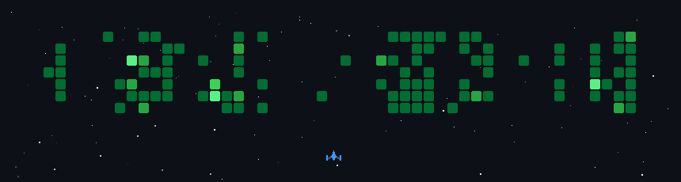

# Luminous🪼

  

I’m a final-year B.Tech (CSE) student specializing in Data Science at BIT, Gorakhpur ’27. 🏛️ Passionate about building AI-powered applications and intelligent systems that solve real-world problems. 🤖
Experienced in AI Engineering, Large Language Models (LLMs), Retrieval-Augmented Generation (RAG), backend development, and open-source collaboration, I enjoy transforming ideas into scalable and impactful products. 💡
I’m currently strengthening my Data Structures & Algorithms (Python), System Design, and AI Engineering skills while exploring AI Agents, Multimodal AI, scalable backend architectures, and cloud deployment. 🚀
Apart from coding, I enjoy contributing to open source, building projects in public, and continuously learning new technologies while helping and mentoring fellow developers in the community... 👨🏻‍💻

  
  
  

  
## 🛠️ Technology Stack

  

<

<h2>🎉 My GitHub Stats</h2>

  <

 

    <!-- Adds extra space below the stats section -->

## 🎮 Competitive Programming

  

  

  
  ## 🌐 Socials
 
  
  
  
  
  
  

  <h2 align="center">🚀 GitHub Space Shooter</h2>

  

  

 ## ✨ Fun Fact

